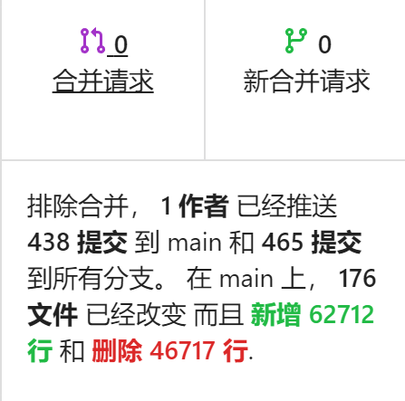

<!-- _class: lead -->
# `experience` of os-comp
##### 分享人：杨金博

---
### OS 比赛

- 全称：2022全国大学生计算机系统能力大赛操作系统设计大赛
- 链接：[https://os.educg.net/2022CSCC](https://os.educg.net/2022CSCC)

### 我的比赛成绩

- 内核赛二等奖

---

### 我能参加 OS 比赛吗？

先介绍一下我在参加 OS 比赛时的基础，对 riscv 有一点了解，在四年前使用 C 写过一点 x86 的内核（或许称为裸机程序更为合理），刚刚开始了解 Rust, 但是对一些语法仍旧不是很熟悉，比如 Rust 的 Result 是在比赛一段时间后刷 Rustlings 才了解并使用，在比赛的初期仍处于和 Rust 编译器高强度对抗阶段。参加比赛时刚刚开始看 rcore-tutorial V3，开始写比赛的内核时学习到第四章。在比赛期间逐渐了解更多内核的知识和内核相关应用程序(比赛测例)。

比赛的周期比较长，有足够的时间去学习需要用的知识，但是有一些前置的知识会更轻松一点。

---

### 比赛期间

- 438 次提交
- 总代码 62712 行
- 现存代码 15995 行
- 大概12000行自己的代码
- 初赛测例全过
- 决赛第一阶段测例全过
- 决赛第二阶段测例过大部分

---

### 遇到问题怎么办

OS 比赛的遇到问题解决方案大致有以下几种：

- 用搜索引擎进行搜索
- 去 Stack overflow 搜索
- 去 Github 查 Issues (一部分问题可以)
- 查看相关项目的代码
- 去啃 Linux 项目的代码
- 看看其他参赛队怎么做的

---

### 是否可以基于已有的项目

如果已经学过 rcore、ucore 或者 xv6 等教学操作系统并且有兴趣继续使用他们或者想减少一些工作量，我很推荐基于已有的项目。

从零开始去构建一个 OS，我认为是很有帮助的，但是不推荐在 OS 比赛中这么做。我是从零开始构建的，在比赛的前期并没有带来什么压力，但是在比赛的后期测例逐渐复杂，早期的设计已经不足以胜任，需要进行部分重构。因此才出现前面叙述的代码新增和删除量都很大，也会对后面功能的编写带来一些心智负担。

---

### 组队参加会不会更好
组队参加自然更好，这样就可以分担一下压力，如果比较有默契会大大减少工作量。